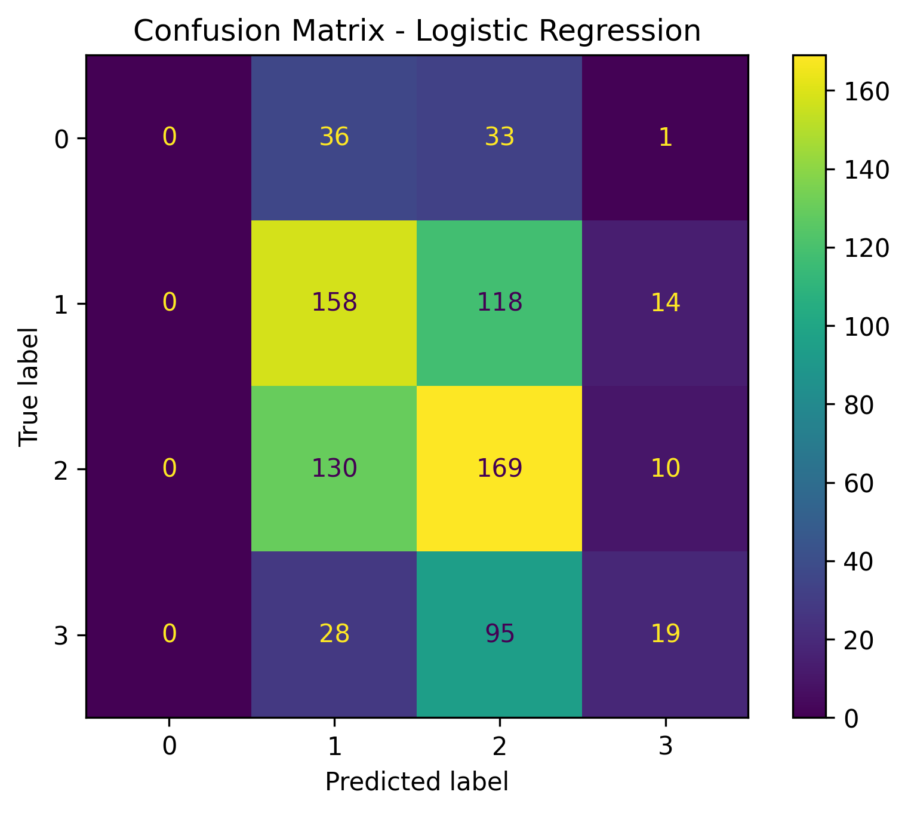
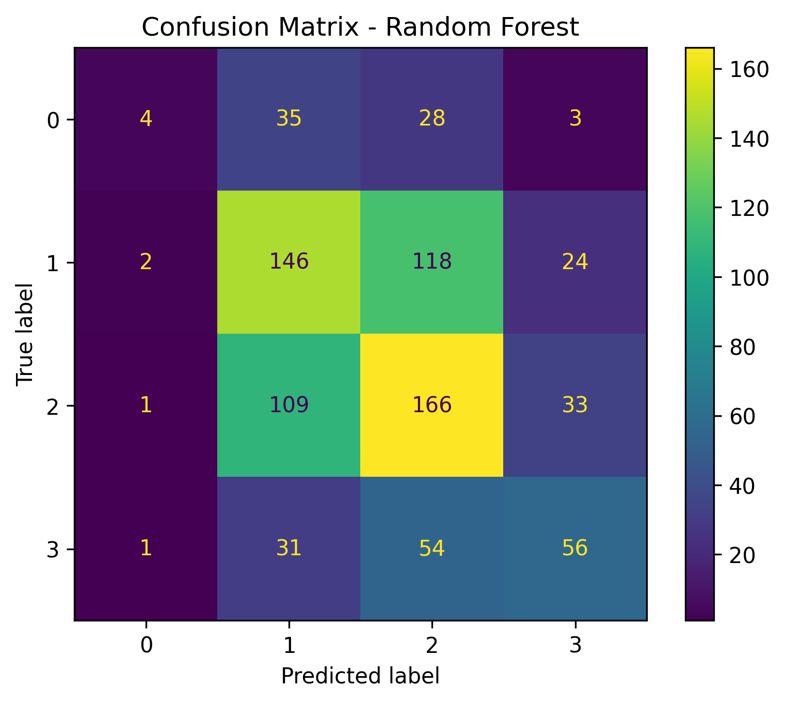

# Accident Severity Prediction - Results

## Dataset

- Total records: 8,116
- Training records: 3,242
- Testing records: 811
- Target variable: Accident Severity
- Severity classes: 1, 2, 3, 4

## Model Performance

| Model | Accuracy | Weighted Precision | Weighted Recall | Weighted F1-Score |
|---|---:|---:|---:|---:|
| Logistic Regression | 42.66% | 0.39 | 0.43 | 0.39 |
| Random Forest | 45.87% | 0.46 | 0.46 | 0.44 |

## Best Model

Random Forest performed better than Logistic Regression based on accuracy and weighted F1-score.

- Accuracy: **45.87%**
- Weighted Precision: **0.46**
- Weighted Recall: **0.46**
- Weighted F1-Score: **0.44**

## Classification Report - Random Forest

| Severity | Precision | Recall | F1-Score | Support |
|---|---:|---:|---:|---:|
| 1 | 0.50 | 0.06 | 0.10 | 70 |
| 2 | 0.45 | 0.50 | 0.48 | 290 |
| 3 | 0.45 | 0.54 | 0.49 | 309 |
| 4 | 0.48 | 0.39 | 0.43 | 142 |

## Confusion Matrices

### Logistic Regression

### Random Forest

## Conclusion

The Random Forest model achieved better overall performance than Logistic Regression on the test dataset. However, the relatively low recall for severity class 1 indicates that the model has difficulty identifying this minority class. Further improvement could be achieved through class balancing, feature engineering, hyperparameter tuning, and alternative machine-learning models.